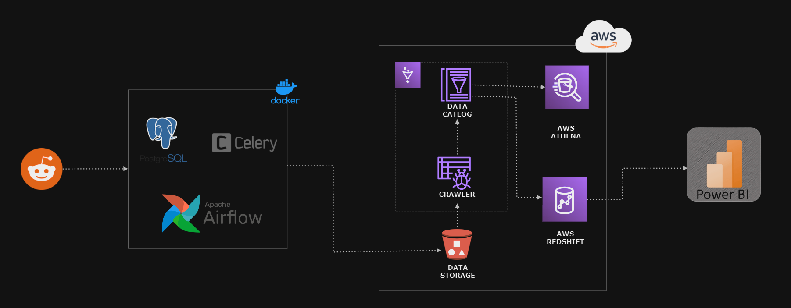

# A comprehensive, open-source data pipeline solution for extracting, transforming, and loading (ETL) Reddit data into an Amazon Redshift data warehouse.



## This project leverages a powerful stack of technologies:

- Apache Airflow: Orchestrates the ETL process and manages task execution.
- Celery: Asynchronously distributes tasks for efficient data processing.
- PostgreSQL: Provides temporary storage and metadata management.
- Amazon S3: Scalably stores raw Reddit data.
- AWS Glue: Catalogs and transforms data using pre-built and custom ETL jobs.
- Amazon Athena: Enables flexible SQL-based data transformation.
- Amazon Redshift: Serves as the central data warehouse for analytics and querying.
- Power BI: Facilitates data visualization and exploration.

## Key Features:

- Robust, Scalable, and Efficient: Handles large data volumes with ease.
- Modular and Open-Source: Extensible and customizable to specific needs.
- Automated Workflow: Airflow orchestrates the entire ETL process with minimal manual intervention.
- Powerful Data Transformation: Leverage AWS Glue and Athena for complex data manipulations.
- Actionable Insights: Analyze Redshift data for data-driven decision making.
- Visualize the Power of Reddit: Connect to Power BI for interactive visualizations.

## Getting Started:

- Prerequisites: AWS account, Reddit API credentials, Docker, Python 3.9+
- Instructions: Detailed setup guide available
- Documentation: Comprehensive documentation provided for each element of the pipeline.

## Setup Guide

**Prerequisites:**

- AWS Account with S3, Glue, Athena, and Redshift permissions.
- Reddit API credentials.
- Docker installed.
- Python 3.9 or higher.

**Steps:**

1. **Clone the Repository:**

   ```bash
   git clone [https://github.com/yash-chauhan-dev/reddit_data_streaming.git](https://github.com/yash-chauhan-dev/reddit_data_streaming.git)
   ```

2. **Set Up Virtual Environment:**
    ```bash
    python3 -m venv venv
    source venv/bin/activate
    ```

3. **Install Dependencies:**
    ```bash
    pip install -r requirements.txt
    ```

4. **Configure Credentials:**

5. **Start Containers:**
    ```bash
    docker-compose up -d
    ```

6. **Access Airflow UI:**
    ```bash
    http://localhost:8080
    ```

## Unleash the Potential of Reddit Data:

Gain valuable insights from Reddit's vast user base and empower data-driven decisions with this flexible and powerful data pipeline.